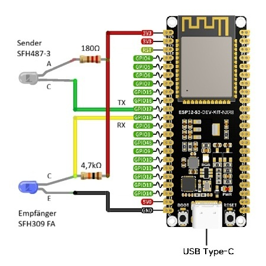

# Allmess Integral MK UltraMaXX (optischer M-Bus) – ESPHome / ESP32-S3

ESPHome External Component zum Auslesen eines **Allmess Integral-MK UltraMaXX** Wärmezählers
über die **optische M-Bus-Schnittstelle** mit korrektem **Wake-Up**, **Parity-Wechsel (8N1 → 8E1)**,
**Init/Request (SND_NKE + REQ_UD2)** und Dekodierung typischer Messwerte.

## Hardware
      

- **ESP32-S3 Devkit** oder kompatibel
- **Optokopf** nach Standard-Schaltung:
  - IR-LED (z.B. SFH487-3) mit 180 Ω Vorwiderstand
  - Phototransistor (z.B. SFH309 FA) mit 4.7 kΩ Pull-Up
  - TX = GPIO 17 → IR-LED
  - RX = GPIO 18 ← Phototransistor
  - Gemeinsame Masse (GND)
 
  
 
## Ausgelesene Daten

Nach erfolgreicher Kommunikation erscheinen in Home Assistant folgende Sensoren:
- Seriennummer
- Gesamt Wärmeenergie (kWh)
- Gesamt Volumen (m³)
- aktuelle Leistung (kW)
- aktueller Durchfluss (l/h)
- Vorlauf-Temperatur (°C)
- Rücklauf-Temperatur (°C)
- Temperatur Differenz (°C)
- Betriebszeit (days)
- Zeitstempel
- Zugriffszähler
- Firmware Version
- Software Version
- Status (All OK/Low Battery/Temporary Error/Permanent Error)

**Hinweis:** 
  - Der Zugriffszähler wird nur bis 255 angezeigt, danach startet wieder bei 0. (nur 1 Bit Wert)
  - Der Zeitstempel Zeigt die Zählerinterne Zeit an. (kann von der tatsächlichen Zeit abweichen)

## Extras
- Onboard LED Fehleranzeige
  kein Fehler = LED Aus / Low Battery = LED dauerhaft gelb / Temporary Error = LED pulsiert rot / Permanent Error = LED dauerhaft rot.
  
